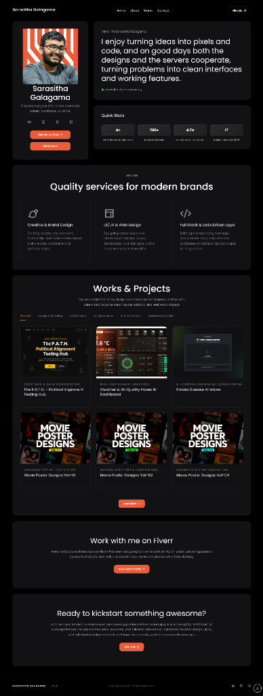

# Sarasitha Galagama - Personal Portfolio



A modern, responsive, and visually striking personal portfolio website built with **React** and **Vite**. This project showcases my work as a Creative Designer and Full-stack Developer, featuring a premium dark-themed UI, glassmorphism effects, and smooth animations.

🔗 **Live Demo:** [sarasitha.me](https://sarasitha.me)

## 🚀 Features

- **Modern UI/UX**: A sleek, dark-themed design with glassmorphism elements and carefully curated color palettes.
- **Fully Responsive**: Optimized for all devices, from large desktops to small mobile phones (iPhone SE/Galaxy S25).
- **Interactive Elements**: Smooth hover effects, custom cursors, and animated transitions.
- **Project Showcase**: A masonry-style or grid layout to display projects with filtering capabilities.
- **Contact Form**: Integrated working contact form (via Formspree).
- **Fast Performance**: Built with Vite for lightning-fast HMR and optimized production builds.

## 🛠️ Tech Stack

- **Frontend Framework**: [React 19](https://react.dev/)
- **Build Tool**: [Vite](https://vitejs.dev/)
- **Styling**: Vanilla CSS (Custom Variables, Flexbox/Grid, Responsive Media Queries)
- **Routing**: [React Router DOM](https://reactrouter.com/)
- **Animations/Carousel**: [Swiper.js](https://swiperjs.com/)
- **Analytics**: [Vercel Analytics](https://vercel.com/analytics)
- **Deployment**: [Vercel](https://vercel.com/)

## 📂 Project Structure

```bash
personalportfolio/
├── public/              # Static assets (images, icons, fonts)
├── src/
│   ├── components/      # Reusable UI components (Header, Footer, Cards)
│   ├── pages/           # Main page views (Home, About, Works, Contact)
│   ├── App.jsx          # Main application component & routing
│   ├── main.jsx         # Entry point
│   └── index.css        # Global styles & variable definitions
├── vercel.json          # Deployment configuration
├── vite.config.js       # Vite configuration
└── package.json         # Dependencies and scripts
```

## ⚡ Getting Started

Follow these steps to set up the project locally on your machine.

### Prerequisites

- Node.js (v18 or higher)
- npm or yarn

### Installation

1.  **Clone the repository:**

    ```bash
    git clone https://github.com/sarasithagalagama/personalportfolio.git
    cd personalportfolio
    ```

2.  **Install dependencies:**

    ```bash
    npm install
    ```

3.  **Run the development server:**

    ```bash
    npm run dev
    ```

    Open [http://localhost:5173](http://localhost:5173) in your browser to view the site.

## 🚀 Deployment

This project is configured for deployment on **Vercel**.

1.  Push your changes to GitHub.
2.  Import the project into Vercel.
3.  The `vercel.json` file handles SPA routing (rewrites to `index.html`).
4.  Deploy!

## 📬 Contact

**Sarasitha Galagama**  
_Creative Designer & Full-stack Developer_

- **Website**: [sarasitha.me](https://sarasitha.me)
- **LinkedIn**: [linkedin.com/in/sarasitha](https://linkedin.com/in/sarasitha)
- **GitHub**: [github.com/sarasitha](https://github.com/sarasitha)
- **Email**: [contact@sarasitha.me](mailto:contact@sarasitha.me)

---

© 2026 Sarasitha Galagama. All Rights Reserved.
