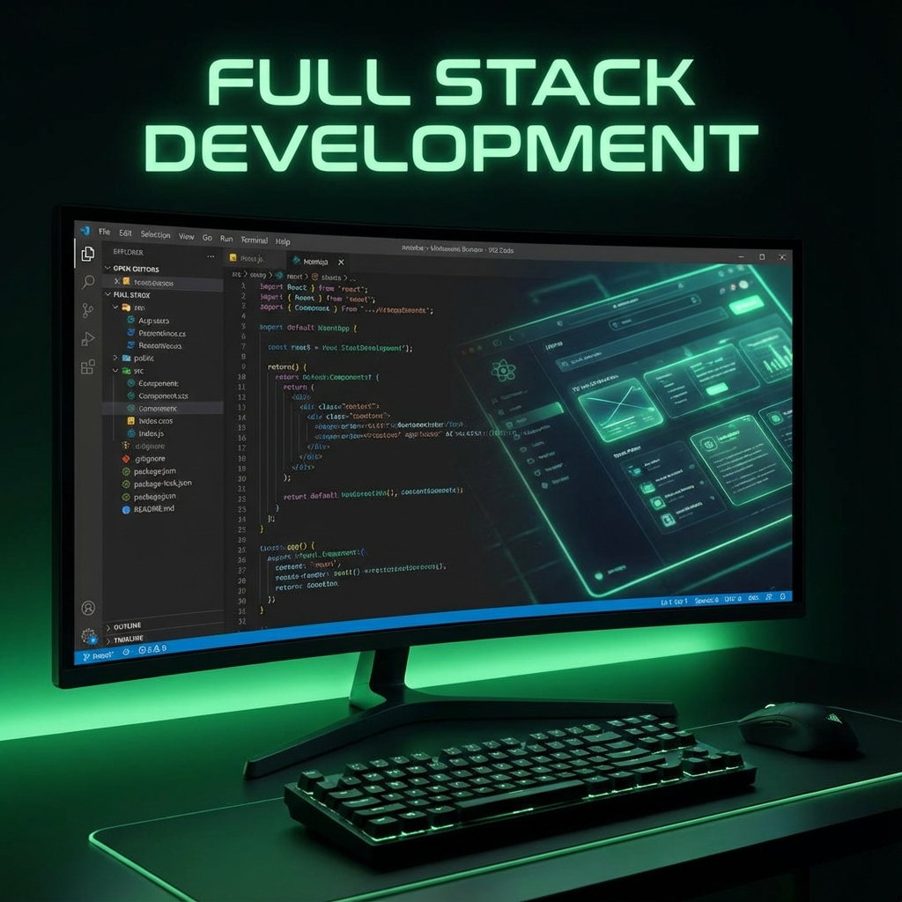
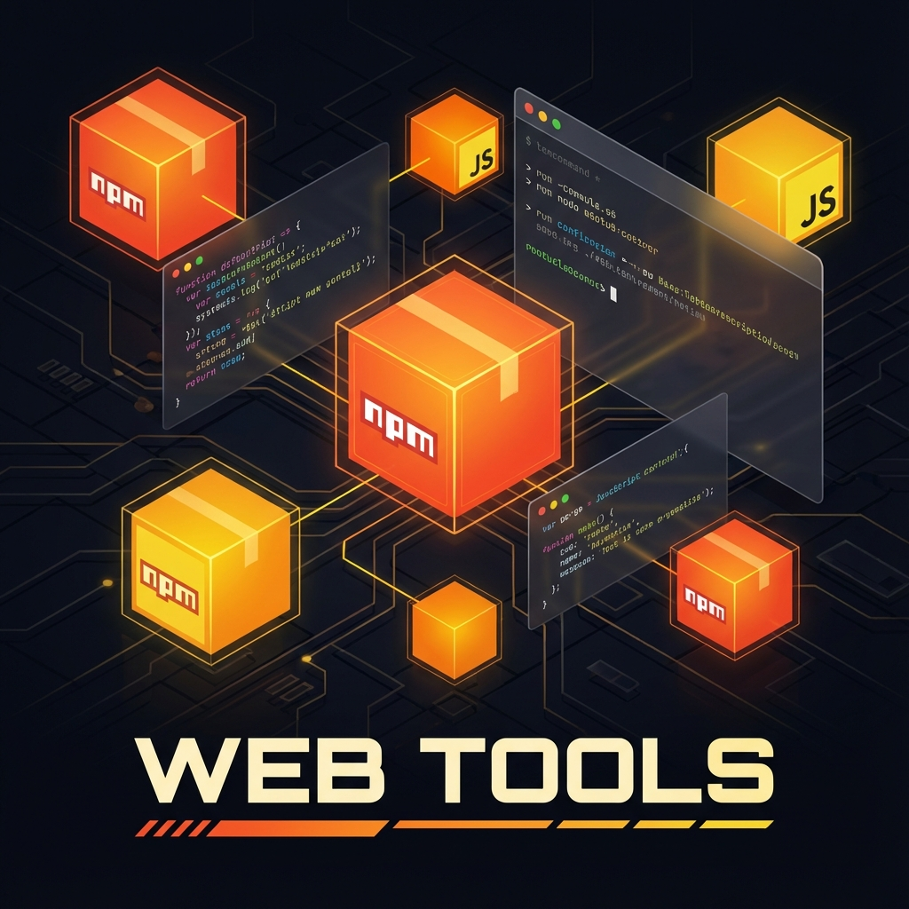
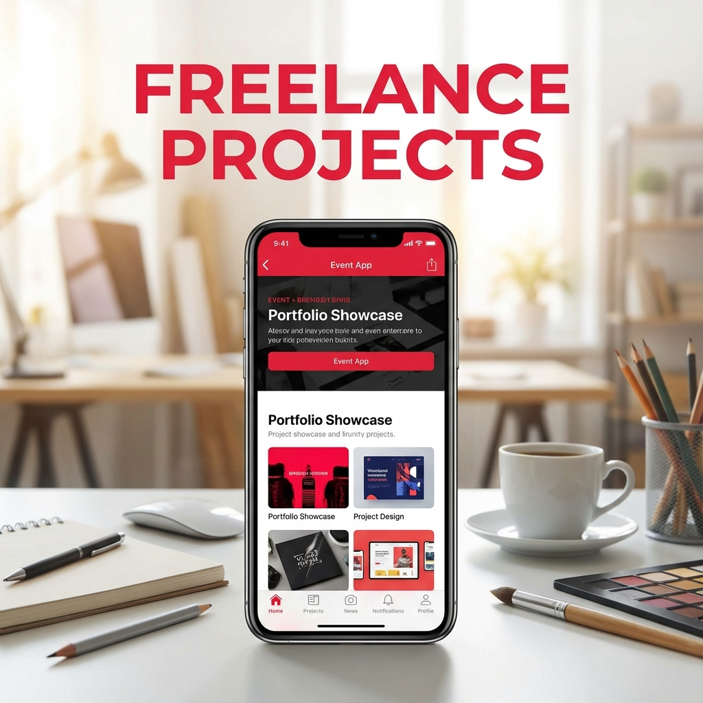

# 🎨 Personal Portfolio

A modern, responsive personal portfolio website built with React and Vite, showcasing full-stack development projects, UI/UX designs, web tools, freelance work, and graphic design.

## ✨ Features

- **Modern Design**: Clean, professional interface with smooth animations
- **Responsive Layout**: Optimized for all devices and screen sizes
- **Multiple Project Categories**:
  - Full-Stack Projects
  - UI/UX Designs
  - Web Tools
  - Freelance Projects
  - Graphic Design
- **Project Detail Pages**: Dedicated pages for in-depth project showcases
- **Interactive Components**: Smooth transitions and hover effects
- **Contact Section**: Easy way for potential clients/employers to reach out
- **Resume Section**: Comprehensive skills and experience display

## 📸 Screenshots

|                               Full Stack Projects                               |                             UI/UX Designs                             |
| :-----------------------------------------------------------------------------: | :-------------------------------------------------------------------: |
|  |  |

|                                   Web Tools                                   |                               Freelance Projects                               |
| :---------------------------------------------------------------------------: | :----------------------------------------------------------------------------: |
|  |  |

## 🛠️ Tech Stack

### Frontend

- **React** (v19.2.1) - UI library
- **React Router DOM** (v7.10.1) - Client-side routing
- **Framer Motion** (v12.23.25) - Animations and transitions
- **React Icons** (v5.5.0) - Icon library
- **React Hook Form** (v7.68.0) - Form handling

### Build Tool

- **Vite** (v7.2.4) - Fast build tool and dev server

### Additional Libraries

- **PhotoSwipe** (v5.4.4) - Image gallery and lightbox

## 📁 Project Structure

```
personalportfolio/
├── personalportfolio-react/
│   ├── public/              # Static assets
│   ├── src/
│   │   ├── components/      # Reusable components
│   │   │   ├── sections/    # Section components (About, Resume, Contact, etc.)
│   │   │   └── Header.jsx   # Navigation header
│   │   ├── layouts/         # Layout components
│   │   │   └── MainLayout.jsx
│   │   ├── pages/           # Page components
│   │   │   ├── Home.jsx
│   │   │   ├── FullStackProjects.jsx
│   │   │   ├── UIUXDesigns.jsx
│   │   │   ├── WebTools.jsx
│   │   │   ├── FreelanceProjects.jsx
│   │   │   ├── GraphicDesign.jsx
│   │   │   └── ProjectDetail.jsx
│   │   ├── styles/          # CSS files
│   │   ├── data/            # Portfolio data
│   │   ├── App.jsx          # Main app component
│   │   └── main.jsx         # Entry point
│   ├── index.html
│   └── package.json
├── .gitignore
└── README.md
```

## 🚀 Getting Started

### Prerequisites

- **Node.js** (v14 or higher)
- **npm** or **yarn**

### Installation

1. **Clone the repository**

   ```bash
   git clone <your-repository-url>
   cd personalportfolio
   ```

2. **Navigate to the React app directory**

   ```bash
   cd personalportfolio-react
   ```

3. **Install dependencies**
   ```bash
   npm install
   ```
   or
   ```bash
   yarn install
   ```

### Development

Run the development server:

```bash
npm run dev
```

or

```bash
yarn dev
```

The application will be available at `http://localhost:5173` (or another port if 5173 is in use).

### Build for Production

Create an optimized production build:

```bash
npm run build
```

or

```bash
yarn build
```

The built files will be in the `dist/` directory.

### Preview Production Build

Preview the production build locally:

```bash
npm run preview
```

or

```bash
yarn preview
```

## 🎯 Usage

### Adding New Projects

1. Navigate to `src/data/portfolioData.js`
2. Add your project details to the appropriate category array
3. Include project images in the `public/` directory
4. Update the project detail page if needed

### Customizing Styles

- Main styles: `src/styles/main.css`
- Responsive fixes: `src/styles/responsive-fixes.css`
- Plugin styles: `src/styles/plugins.css`

### Updating Content

- **About Section**: Edit `src/components/sections/About.jsx`
- **Resume/Skills**: Edit `src/components/sections/Resume.jsx`
- **Contact Info**: Edit `src/components/sections/Contact.jsx`

## 📱 Responsive Design

The portfolio is fully responsive and optimized for:

- 📱 Mobile devices (320px and up)
- 📱 Tablets (768px and up)
- 💻 Laptops (1024px and up)
- 🖥️ Desktops (1440px and up)

## 🤝 Contributing

This is a personal portfolio project, but suggestions and feedback are welcome!

1. Fork the repository
2. Create your feature branch (`git checkout -b feature/AmazingFeature`)
3. Commit your changes (`git commit -m 'Add some AmazingFeature'`)
4. Push to the branch (`git push origin feature/AmazingFeature`)
5. Open a Pull Request

## 📄 License

This project is open source and available under the [MIT License](LICENSE).

## 📧 Contact

For any inquiries or collaboration opportunities, please use the contact form on the portfolio website.

---

**Built with ❤️ using React and Vite**
